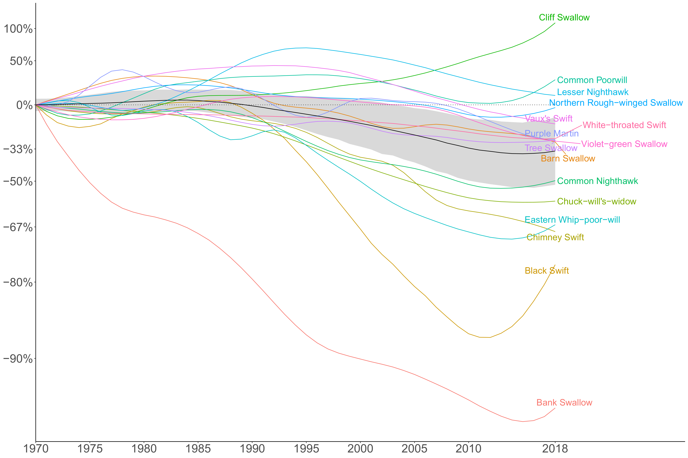

# Aerial_Insectivores
Population trajectories for aerial insectivorous birds in North America

Composite Trajectories (State of Birds Indicator lines). This repository creates State of Canada’s Birds (SOCB) analyses for AI, using new BBS results. The SOCB model has been applied to three different groupings of aerial insectivores: Swallows Swifts and Nightjars, Flycatchers, and the SOCB-AI grouping which included all Swallow Swifts and Nightjars with some distribution in Canada plus three flycatchers (Eastern and Western Wood-Peewee, and Olive-sided Flycatcher). For each of these three groups, there’s a sub-folder that contains all of the results for the composite model applied at the following scales: Continental, national, and province/state. Note: all of these groupings exclude Cave Swallows, as their extreme increase greatly increases the uncertainty of the group patterns.

## This analysis produces two main kinds of plots. 

### Species-detail "spaghetti" plots with the composite indicator and underlying species lines.

### Regional Geofacet plots with the composite indicator across spatial regions.

